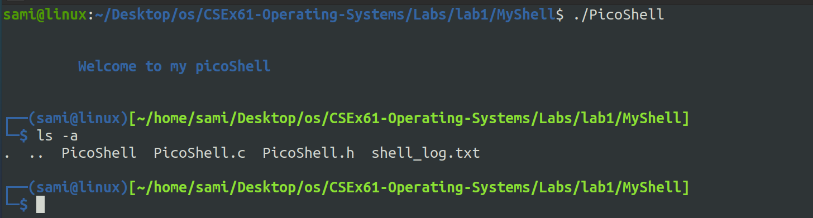

# PicoShell


PicoShell is a simple shell implementation written in C for [Lab1:Simple Shell (Multi-Processing)](../Simple%20Shell%20(Multi-Processing)/) and supports the following features:

- **Custom Prompt**: Displays user, host, and current directory information in a custom prompt format.
- **Built-in Commands**: Supports built-in commands such as `cd`, `echo`, `export`, and `pwd`.
- **Background Execution**: Allows executing commands in the background using the `&` symbol.
- **Input Parsing**: Parses user input to tokenize command arguments.
- **Command Execution**: Forks child processes to execute external commands using `execvp`.
- **Signal Handling**: Handles SIGCHLD signal to reap zombie processes and log child process terminations.
- **Logging**: Logs shell activities to a file (`shell_log.txt`).

## Usage


```sh
gcc PicoShell.c -o PicoShell
./PicoShell